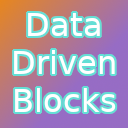

<h1 align="center">Data Driven Blocks</h1>

Adds support to add custom blocks to the game using datapacks!
                                                                                         

---

Inspired by the custom block system on Minecraft: Bedrock Edition

## Credits

* BJTMastermind